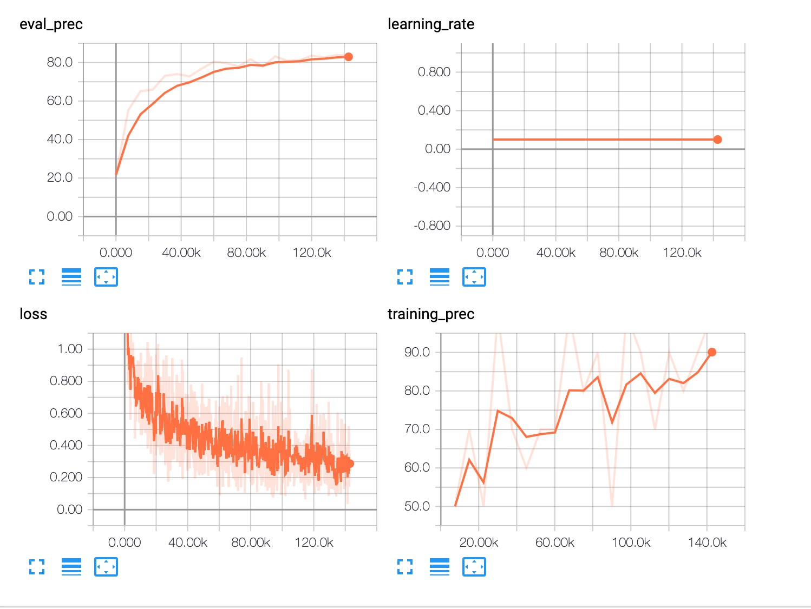
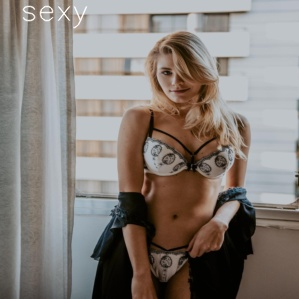
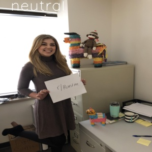

NSFW pytorch implementation
=========
[](#contributors)

This repo contains code for running Not Suitable for Work (NSFW) classification deep neural network pytorch models.

According to [yahoo-open-nsfw](https://yahooeng.tumblr.com/post/151148689421/open-sourcing-a-deep-learning-solution-for)
fine-tune with resnet or dpn


Data
---------
You can get some data from [nsfw_data_scrapper](https://github.com/alexkimxyz/nsfw_data_scrapper).
Then put your datas at data/train and data/test.

Train
---------
Get [pretrained resnet model](https://download.pytorch.org/models/resnet50-19c8e357.pth), and put it in models/.

training with pretrained model:
```bash
python src/train.py --saved_model 'models/resnet50-19c8e357.pth'
```

training from scratch:
```bash
python src/train.py --saved_model ''
```

check from tensorboardx:
```bash
/bin/tensorboard --logdir runs/Feb18_14-47-30_ubuntu16-NF5280M4/
```


Test
---------
```bash
python src/test_img.py --batch_size 1 --image_size 299 --test_data_dir data/test_save/  --saved_model models/epoch_53.pkl --save_path data/result/
```

Result
---------
  

confusion matrix:
```
          drawings    hentai    neutral    porn    sexy
drawings   1660          216       101        8      15
hentai       65         1845        16       70       4
neutral      24           12      1805      117      42
porn          2           61        22     1901      14
sexy          3           11        63      524    1399
```
compare with yahoo's implementation using the same test datas
```
      sfw   nsfw
sfw   5711  2289
nsfw  267   1733
```
* notes: some datas from nsfw_data_scrapper are not proper classified

## Contributors

